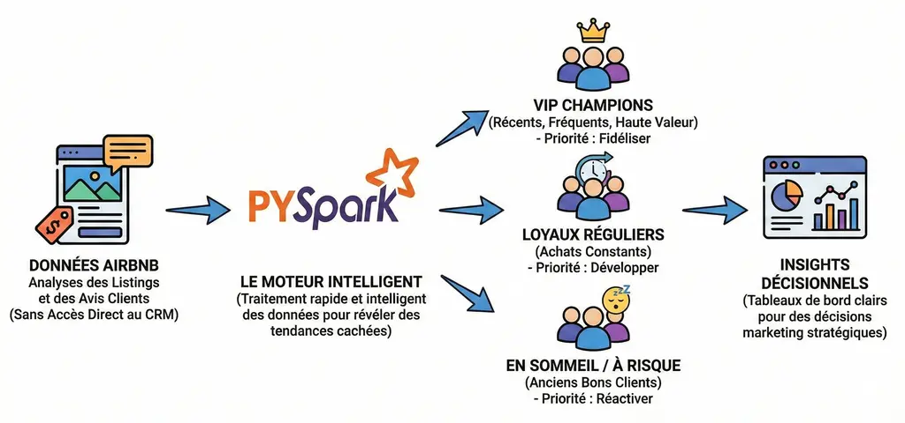

# Airbnb: Market Intelligence & RFM Segmentation



---


## 📋 Problem Statement

In tourism, understanding competitors' customers like Airbnb is key to gaining market share, but transactional data is confidential. This project uses public data (Airbnb reviews and listings) to model market activity via RFM (Recency, Frequency, Monetary) analysis at scale with PySpark.
---

## 🎯 Objectives

- Clean and join millions of reviews and listings to reconstruct estimated transactions.

- Compute RFM scores by neighborhood and city to segment travelers (Champions, Loyal, At-Risk).

- Identify opportunities: high-demand neighborhoods, priority customer profiles, real pricing calibration.
​
- Ensure distributed scalability with PySpark for massive textual and numerical data volumes.

---

## 📦 Dataset

Public Airbnb data: reviews (customer feedback) and listings (accommodations with prices). Each review proxies a transaction: location (neighborhood), estimated amount (nightly price), dates for RFM. 

Source : [[https://insideairbnb.com/fr/get-the-data/](https://insideairbnb.com/fr/get-the-data/)]

---

## 🧠 Approach

- Distributed ETL: Cleaning (dates, currencies), joining reviews-listings for transactions.

- RFM Calculation: Recency (days since last review), Frequency (review count), Monetary (sum of estimated prices).

- Segmentation: RFM quintiles to classify customers (Champions: high R/F/M).

- Spatial Analysis: Aggregation by neighborhood for market insights

---

## 🧩 Features

- PySpark Pipeline: Distributed processing of large volumes (millions of reviews).

- RFM Segmentation: Identify Champions/Loyal/At-Risk by neighborhood.

- Scalability: Handle massive textual/numerical data efficiently.

- Actionable Insights: Traveler profiles, demanded neighborhoods, accepted real prices.

---

## 📁 Project Structure

```
├── config
│   └── settings.py                    # Configuration management & environment variables
├── data                               # Raw Airbnb listings & reviews data
├── Dockerfile                         # Docker container for PySpark environment
├── docs                               # Documentation, screenshots, API references
├── Makefile                           # Development commands & pipeline orchestration
├── pyproject.toml                     # Project configuration & dependencies
├── src
│   └── airbnb_rfm_pyspark
│       ├── app.py                     # Streamlit app entrypoint
│       ├── business
│       │   └── recommendations.py     # RFM-based customer recommendations
│       ├── core
│       │   ├── data_quality.py        # Data validation & quality checks
│       │   ├── logger.py              # Structured logging configuration
│       │   ├── pipeline_monitor.py    # Pipeline health & performance monitoring
│       │   └── spark_session.py       # PySpark session management & optimization
│       ├── data
│       │   └── ingestion.py           # Airbnb data loading & schema inference
│       └── processing
│           ├── cleaners.py            # Data cleaning (dates, currencies, addresses)
│           └── rfm_engine.py          # RFM calculation & customer segmentation
├── tests
│   ├── test_data_quality.py           # Unit tests for data validation
│   └── test_pipeline_e2e.py           # End-to-end pipeline integration tests
└── uv.lock                            # uv dependency lockfile
```


## 🚀 Getting Started

### ⚙️ Prerequisites

- Python 3.12+
- uv or virtualenv
- Docker & Docker Compose (optional)
- Java 11+ (for Spark)
- PySpark, Pandas


### 🖥️ Setup

#### Using uv

Installing uv (if necessary):

```bash
curl -LsSf https://astral.sh/uv/install.sh | sh
```

Create a virtual environment and install dependencies:

```bash
uv venv
```

Activate the virtual environment:

On Linux and macOS:

```bash
source .venv/bin/activate
```

On Windows:

```bash
.venv\Scripts\activate
```

Install dependencies:

```bash
uv pip install -r pyproject.toml
```

### 🖥️ Setup Environment variables

```bash
cp env.example .env
```

Edit ".env" file if needed

## 🐳 Docker Commands

```bash
# Build image
docker build -t airbnb-rfm-pyspark:latest .

# Quick Run (dev - auto-cleanup)
docker run --rm -p 8501:8501 airbnb-rfm-pyspark:latest

# Run container on development
docker run --rm -p 8501:8501 \
  --name airbnb-rfm \
  -v $(pwd)/data:/app/data \
  airbnb-rfm-pyspark:latest

# View logs
docker logs -f airbnb-rfm

# Stop and remove
docker stop airbnb-rfm && docker rm airbnb-rfm
```

## 🚀 Run locally

```bash
# Local
uv run streamlit run src/airbnb_rfm_pyspark/app.py
```

---


## ✨ Contributing

1. Fork the repository
2. Create a new branch (`git checkout -b feature/your-feature`)
3. Make your changes
4. Commit your changes (`git commit -am 'Add some feature'`)
5. Push to the branch (`git push origin feature/your-feature`)
6. Create a new Pull Request

---


## 📄 License

This project is under the **MIT License**. See [LICENSE](LICENSE) for more details.

---

## 👤 Author

**Jean-Michel LIEVIN**  
Data & IA Enthusiast | Full Stack Senior (10+ years)

- 🌐 Portfolio: [github.com/tabodino](https://github.com/tabodino)
- 💼 LinkedIn: [linkedin.com/in/jean-michel-lievin](https://www.linkedin.com/in/jean-michel-lievin)
- 📧 Email: [jeanmichel.liev1@gmail.com](mailto:jeanmichel.liev1@gmail.com)

---

## 🛠️ Support

For issues and questions, open an issue on GitHub.

[](mailto:jeanmichel.liev1@gmail.com)
[](https://github.com/tabodino/airbnb-rfm-pyspark/issues)
